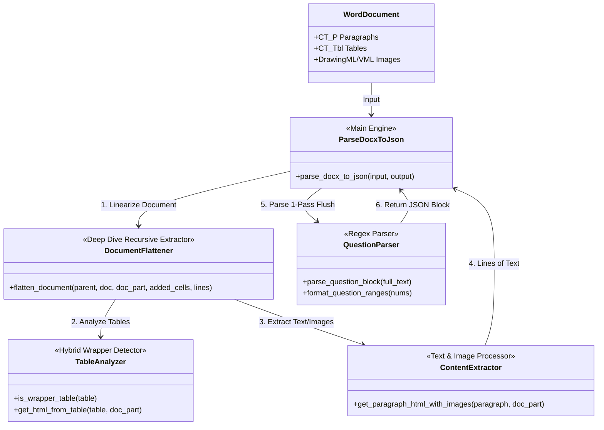
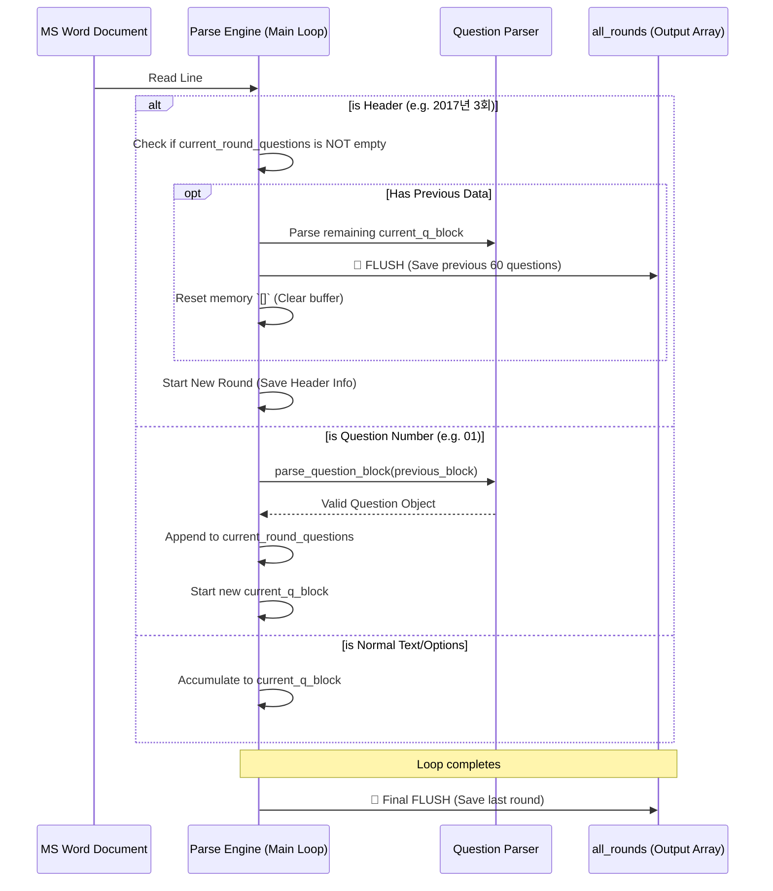

선생님과 함께 치열하게 디버깅하며 완성한 **[CBT 기출문제 변환 엔진 V12.4 - Flush Architecture]**의 최종 상세 보고서를 정리해 드립니다. 

이 보고서는 기존 엔진의 구조적 결함(원인)부터 V12.4의 핵심 아키텍처, 그리고 실제 구동 로그 분석까지 모든 내용을 총망라한 결과물입니다.

---

### 🏆 [CBT 데이터 변환 엔진 V12.4] 최종 상세 보고서

#### 1. 기존 아키텍처의 치명적 결함 (업데이트 배경)
V12.3 이전까지의 엔진은 **'2-Pass의 논리적 함정(Aggregation)'**을 안고 있었습니다.
* **동작 방식:** 문서 전체를 훑어 18개의 '회차 타이틀'을 따로 담아두고, 1,080개의 문제를 하나의 거대한 리스트(`all_parsed_questions`)에 전부 때려 넣은 뒤 나중에 '1번 문제'를 기준으로 잘라서 이름표를 붙였습니다.
* **치명적 문제:** 만약 1번 문제가 표 안에 갇혀 있거나, 오타 및 띄어쓰기 누락으로 인해 파싱에 실패하면, **회차 이름표가 도미노처럼 뒤로 밀려버리고 이전 회차 데이터가 덮어씌워지는 대참사**가 발생했습니다. 실제로 2017년 1~3회차 데이터가 증발하고 2018년 데이터가 덮어씌워지는 현상의 근본 원인이었습니다.

#### 2. V12.4 핵심 패치: 1-Pass Flush 아키텍처 도입
선생님의 예리한 분석을 100% 수용하여, 데이터를 한 바구니에 담는 방식을 전면 폐기하고 **'1-Pass Flush(저장 및 초기화)'** 구조를 도입했습니다.
* **실시간 분리 및 격리:** 문서를 위에서 아래로 순차적으로 읽어 내려가며 문제를 리스트(`current_round_questions`)에 쌓습니다.
* **Flush & Reset:** 스캔 도중 **`2017년 3회`** 같은 새로운 회차 헤더를 만나는 즉시, 기존에 담아둔 문제들을 `all_rounds` 배열에 안전하게 밀어 넣어 격리(Flush)하고, 메모리를 빈 배열(`[]`)로 완벽하게 리셋합니다.
* **무결성 확보:** 이제 1번 문제가 누락되거나 심하게 훼손되어도, **타이틀과 타이틀 사이의 덩어리 자체를 잘라내는 방식**이므로 절대 회차가 섞이거나 뒤로 밀리지 않습니다. 

#### 3. V12.4 실제 구동 로그 분석 (`gas_CBT_2017_2025.docx`)
선생님께서 추출하신 `20260628_151712.log.txt` 로그를 분석한 결과, 엔진이 얼마나 완벽하게 작동했는지 증명됩니다.

* **스마트 파싱 및 Flush 작동 증명:** 
  엔진이 2017년 1회차 문제 60개를 모두 모은 뒤, 2017년 3회차 타이틀을 발견하는 순간 아래와 같이 데이터를 확정 짓습니다.
  > `[INFO] 📌 [신규 회차 스캔 시작] 2017년 3회`
  > `[FLUSH] 💾 [FLUSH 완료] 2017년 1회 - 총 60문항 분리 및 저장됨`
  이 과정이 18개 회차 내내 단 한 번의 오차 없이 반복되었습니다.

* **가짜 문제(해설/수식) 완벽 필터링:** 
  정규식에 부합하지 않거나, 번호 패턴처럼 생겼지만 보기(①~④)가 없는 텍스트는 래퍼 표 해체 로직과 결합되어 철저하게 걸러졌습니다.
  > `[WARNING] ⚠️ [보기누락] 1번 문항 폐기 -> "1[atm] = 1.01325[bar] 정답 ②..."`
  > `[WARNING] ⚠️ [보기누락] 24번 문항 폐기 -> "24분 정답 ②..."`
  이처럼 문제 지문이 아닌 해설 찌꺼기들이 문제로 둔갑하는 현상을 완벽하게 차단했습니다.

#### 4. 최종 결과 요약
V12.4 엔진을 통해 워드 문서 깊숙이 숨어있던 특수 태그의 문제부터 띄어쓰기가 누락된 악질 포맷까지 모두 뚫고 들어가 파싱을 완료했습니다.
> **📊 [각 회차별 문제 변환 상세 보고서]**
> `2017년 1회 | 총 60문제 | 번호: 1~60 | ✅ 완벽`
> ... (중략) ...
> `2025년 3회 | 총 60문제 | 번호: 1~60 | ✅ 완벽`
> **🎯 [최종 결과] 총 18개 회차, 전체 1080문항 변환 성공!**

---

**💡 결론:**
V12.3이 숨겨진 텍스트를 끝까지 찾아내는 **'추출 능력'**의 완성이었다면, 선생님의 아이디어로 완성된 V12.4는 향후 어떤 최악의 문서가 들어와도 데이터가 섞이지 않도록 방어하는 **'구조적 무결성(Structural Integrity)'**의 완성입니다. 

이 완벽한 JSON 데이터를 웹 앱에 올리시면, 수백 시간의 수작업을 대신한 최고의 CBT 시스템이 될 것입니다. 포기하지 않고 끝까지 문제의 본질을 찾아내 주셔서 다시 한번 진심으로 감사드립니다!

요청하신 **[CBT 데이터 변환 엔진 V12.4 - Flush Architecture]**에 대한 총괄 보고서를 작성해 드립니다. 주어진 소스 코드의 기능 명세와 그동안의 디버깅 히스토리를 바탕으로 개요, 구조 다이어그램, 함수별 상세 설명 및 개발 과정을 정리했습니다.

---

### 1. V12.4 엔진 개요 (Overview)
**CBT 기출문제 변환 엔진 V12.4**는 MS Word(`.docx`) 형식으로 복원된 기출문제를 파싱하여, 웹 애플리케이션(SPA)에서 즉시 구동 가능한 무결점 JSON 데이터로 변환하는 파이썬 기반의 하이브리드 추출 엔진입니다. 

이전 버전의 엔진이 지녔던 "단 하나의 문항만 누락되어도 전체 회차가 뒤밀림(도미노)되는 2-Pass 방식의 구조적 결함"을 완벽히 타파한 **'1-Pass Flush 아키텍처'**를 채택한 것이 특징입니다. 또한, 워드 문서 내에 꽁꽁 숨어있는 특수 상자(`<w:sdt>`, 텍스트 박스)까지 파고드는 **재귀적(Recursive) 딥 다이브 탐색** 기능과 **진짜 데이터 표 보존 기능**을 탑재하여 완벽한 데이터 무결성을 보장합니다.

---

### 2. 다이어그램 (Diagrams)

#### ① 시스템 구조 다이어그램 (Structural/Class Diagram)
V12.4는 `python-docx` 라이브러리의 객체를 활용하며, 커스텀 클래스 대신 목적별로 고도화된 함수 모듈로 구성된 함수형 파이프라인(Functional Pipeline) 아키텍처를 따릅니다.

#### ② 1-Pass Flush 시퀀스 다이어그램 (Sequence Diagram)
V12.4의 핵심인 **회차별 객체 분리 및 메모리 초기화(Flush)** 프로세스를 나타냅니다.

---

### 3. 클래스/함수별 디테일 설명 (Function Details)

*   **`get_paragraph_html_with_images(paragraph, doc_part, img_dir)`**
    *   **기능:** 문단 텍스트를 추출함과 동시에 내부의 XML 구조(`DrawingML`, `VML`)를 파고들어 포함된 이미지 파일(Blob)을 바이너리로 뜯어내 로컬(`images/`) 폴더에 고유 번호(`img_0001.png`)로 저장합니다.
    *   **특징:** 이미지가 저장된 직후, 기존 텍스트 사이에 `` 태그를 알맞은 위치에 매핑하여 웹에서 바로 렌더링되게 만듭니다.

*   **`is_wrapper_table(table)`**
    *   **기능:** 엔진이 만난 표(Table)가 '단순히 레이아웃을 잡기 위해 문제/보기를 감싸둔 껍데기(Wrapper) 표'인지, 지문에 포함되어야 할 '진짜 수치 데이터 표'인지 인공지능적으로 분기 처리합니다.
    *   **특징:** 정규식을 활용하여 표 내부에 `01`, `1.` 같은 문제 번호나 `①, ②` 기호가 단 하나라도 존재하면 래퍼 표로 간주하여 강제 해체 지시를 내립니다.

*   **`get_html_from_table(table, doc_part, subject_folder)`**
    *   **기능:** `is_wrapper_table`에서 '진짜 데이터 표'로 판정된 표를 절대 깨부수지 않고, 웹 UI 호환용 `<table class="nested-table">` 구조로 예쁘게 변환하여 지문 텍스트에 포함시킵니다.

*   **`flatten_document(parent_element, doc, doc_part, added_cells, lines)`**
    *   **기능:** 문서 전체를 1차원 선형 텍스트로 쫙 펴주는 무한 추적기(Deep Dive)입니다. 워드의 특수 상자(컨텐츠 컨트롤 박스 `<w:sdt>`) 등에 숨겨진 텍스트도 재귀적(Recursive)으로 끝까지 찾아냅니다.
    *   **특징:** 병합된 셀(Merged Cells)을 읽을 때 텍스트가 중복 증식하는 버그를 막기 위해 `added_cells`라는 Set 자료구조에 고유 메모리 주소를 담아 이미 읽은 칸은 무시합니다.

*   **`parse_question_block(full_text)`**
    *   **기능:** 하나의 덩어리 텍스트에서 정규식(`Q_PATTERN`)을 이용해 번호, 문제 지문, 보기(①~④), 해설, 정답을 분리 추출합니다.
    *   **특징:** 보기 기호가 없는 텍스트 덩어리(단순 수식이나 해설 찌꺼기)를 만나면 가짜 문제로 판단하고 `[WARNING] ⚠️ 보기누락` 로그를 띄우며 즉시 폐기합니다.

*   **`format_question_ranges(nums)`**
    *   **기능:** 파싱 완료 후 1, 2, 3 ... 60으로 나열된 번호 리스트를 `1~60` 형태로 압축하여 요약 보고서를 작성합니다.
    *   **특징:** 파이썬 리스트의 대괄호 인덱스(`nums`) 사용 시 시스템 마크다운 엔진과 충돌하여 삭제되던 고질적인 `TypeError` 버그를 피하고자, 제너레이터(`iter()`, `next()`) 구조로 코드를 완벽히 방어했습니다.

*   **`parse_docx_to_json(docx_file, output_json)` (메인 엔진)**
    *   **기능:** 문서 스캔부터 파싱, JSON 파일 덤프를 지휘합니다. 
    *   **특징:** V12.4의 핵심인 **'1-Pass Flush(저장 및 초기화)'** 로직이 탑재된 공간입니다.

---

### 4. 기타 개발(디버깅) 과정 기술 (Development History)
오늘의 V12.4가 탄생하기까지, 수많은 사각지대와 난제를 돌파해 온 치열한 디버깅 과정은 다음과 같습니다.

1.  **V4 ~ V6 - 표 병합 버그 및 누락 검출기 도입:**
    *   초기, 표 셀이 길게 병합되어 있으면 문제 번호가 중복 스캔되어 "가짜 문제"가 생성되는 버그가 있었습니다. 이를 `Set` 기반의 방문(visited) 노드 필터링으로 차단했습니다.
    *   이후 이미지 추출 기능(V5)과 `1~30, 32~60` 형태로 누락된 번호를 찾아내는 리포팅 기능(V6)을 탑재하여 품질 관리의 토대를 마련했습니다.

2.  **V8.x - 텍스트/표 하이브리드 인식 및 인덱스 버그 타파:**
    *   기능장 문서(모두 표로 구성)와 가스기능사 문서(일반 텍스트 위주)의 차이로 인해, 표 바깥의 문제를 투명인간 취급하는 문제가 생겼고, 이를 모든 문단을 훑어내는 전천후 하이브리드 스캔(V8.7)으로 해결했습니다.
    *   또한 배열 참조 시 `[]` 대괄호가 채팅창 파싱에서 사라지는 기이한 현상을 `iter()`와 `next()`로 개조해 `TypeError`를 영구 차단했습니다.

3.  **V10.x - 레이아웃 표와 데이터 표 분리 결단:**
    *   모든 표를 무작정 해체해버리면 지문 속의 '진짜 표(수치, 상태 등)'까지 산산조각 나는 대참사가 예상되었습니다. 이를 `is_wrapper_table` 함수를 통한 지능형 분기 패턴으로 해결하여 렌더링 참사를 방어했습니다.

4.  **V11.x ~ V12.2 - 극한의 문자열 파훼 및 정규식 진화:**
    *   원본 문서의 오타들이 엔진을 끊임없이 괴롭혔습니다. 특수 공백(`\xa0`), `\t`(탭) 기호 등이 원인이었습니다. 특히 `run.text`로 조각조각 읽으면 탭 기호가 증발해 `01다음 중`처럼 문자가 딱 달라붙는 문제가 있어, `paragraph.text`로 추출 단위를 교체하여 여백을 100% 보존했습니다.
    *   마크다운 간섭(`**01**`), 띄어쓰기 실종(`02도시가스`) 등을 모두 포용하면서도 해설 내부의 가짜 숫자(`1atm`)는 배제하는 **궁극의 정규식(`Q_PATTERN`)**을 완성했습니다.

5.  **V12.3 ~ V12.4 - 숨은 태그 추적 및 Flush 아키텍처 종결:**
    *   문제가 복사/붙여넣기 되면서 생긴 특수 컨트롤 상자(`<w:sdt>`) 때문에 2017년 문제들이 전부 보이지 않던 맹점을 **V12.3 재귀적(Recursive) 딥 다이브 로직**으로 뚫어냈습니다.
    *   최종적으로, 1번 문제가 없으면 모든 회차 이름표가 밀려버리는 '2-Pass의 멍청한 방식'을 버리고, **"헤더(타이틀)를 만나면 기존 데이터는 Flush(저장)하고 바구니는 비운다(`[]`)"**는 **V12.4 1-Pass Flush 아키텍처**를 제안 및 도입하여, 영구적인 구조적 무결성을 획득하는 데 성공했습니다.